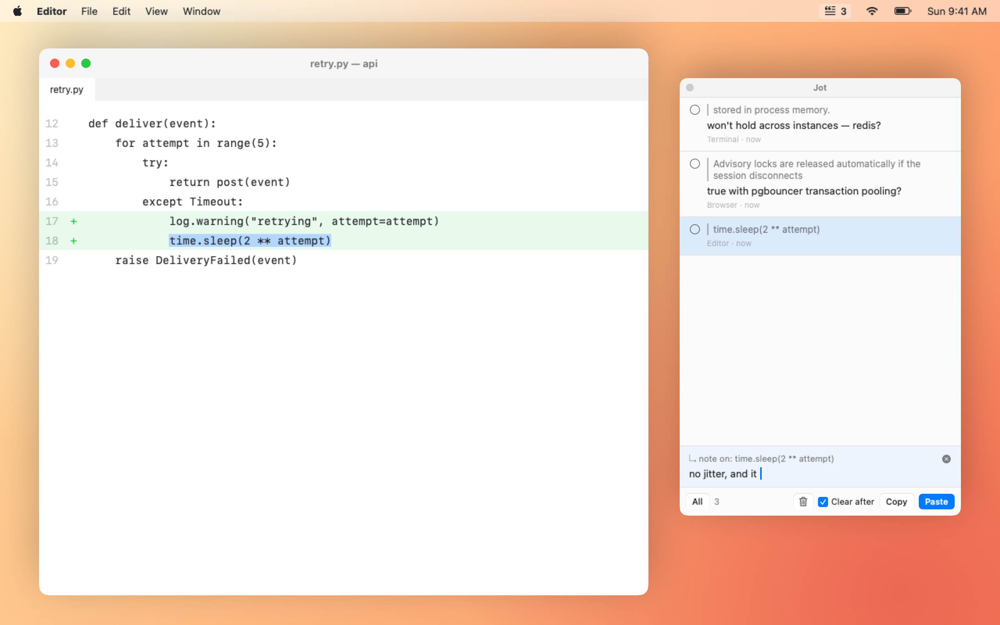

<p align="center"></p>
<h1 align="center">Jot</h1>
<p align="center"><b>A scratchpad for reviewing AI output — in every agent, browser and editor.</b><br>
Three gestures. No setup, no account, no sync.</p>

<p align="center"></p>

You're reading an agent's plan in the terminal, a chat answer in the browser, a diff in your editor —
and you keep having reactions that aren't ready to send yet. Jot collects them in one place, wherever
they came from, and pastes the whole batch back — quoted and annotated — right where your cursor is.

**⇧⇧** capture what you selected (and note why) · **⌘⌘** jot a thought · **⌃⌃** paste it all back. That's the whole app.

- **Every tool, one inbox.** Terminal agents, AI chats in the browser, code editors, PR diffs, docs —
  anything you can select text in. Each item remembers where it came from.
- **Never breaks your flow.** No windows to switch to, nothing to organize. Capture, keep reading,
  dump it all when you're ready.
- **Talk instead of type.** Dictation tools (e.g. Wispr Flow) work in the note field.
- **Tiny and local.** One Swift file, no dependencies, no network. Notes are a local JSON file.

## Gestures

| | | |
|---|---|---|
| **⇧⇧** | tap Shift twice | Capture the selected text, then type an optional note (**↩** saves and returns you to your app, **esc** skips the note) |
| **⌘⌘** | tap Command twice | Jot a thought in the widget; **↩** saves and keeps the cursor for the next one. Again to go back |
| **⌃⌃** | tap Control twice | Paste checked items (or all) at your cursor, then clear them |

In the widget: **⌘↩** paste · **⌘⇧C** copy · **⌘⇧⌫** clear (with undo) · **⌘⇧A** select all/none.
Click an item to edit its note; click its circle to check it. The close button tucks Jot into the
menu bar (left-click the icon to bring it back, right-click for the menu).

Pasted output is plain markdown, ready for any agent or chat:

```
> stored in process memory.
won't hold across instances — redis?

> time.sleep(2 ** attempt)
no jitter, and it blocks the worker

overall: ask for a rollout plan
```

<p align="center"></p>

## Install

Requires macOS 14+ and the Xcode Command Line Tools (`xcode-select --install`).

```sh
git clone <this repo> && cd jot
./build.sh                  # builds and installs ~/Applications/Jot.app
open ~/Applications/Jot.app
```

Then allow Jot in **System Settings → Privacy & Security → Accessibility** (the widget shows a
banner until you do). Jot needs it to read your selection and to type the paste for you.

> Builds are ad-hoc signed, so macOS forgets the Accessibility grant after every rebuild —
> remove Jot from the list and add it again.

Right-click the menu-bar icon → **Launch at Login** to keep it around.

## How it works

- Double taps are detected from global `flagsChanged` events: a lone modifier pressed and released
  twice within ~0.4s with nothing else in between, so Shift-typing and Shift-clicking don't trigger it.
- Capture reads the selection via the Accessibility API; apps that don't expose it (many terminals,
  Electron) fall back to a synthetic ⌘C with your clipboard restored right after.
- The widget is a non-activating `NSPanel`, which is why paste can send ⌘V to the app you were in.
- Items: `~/Library/Application Support/Jot/items.json` · debug log: `~/Library/Logs/Jot.log`.

## Media

Everything under `assets/` is rendered from a scripted SwiftUI mock (`promo/Promo.swift`) — no screen
recording. `promo/render.sh` regenerates `hero.png`, `widget.png`, `demo.gif` and `demo.mp4`
(or `promo/bin/promo assets frames <dir>` dumps a 30fps PNG sequence for ffmpeg).
The icon is `promo/icon.svg`.

## Credits

Gesture design inspired by [Copper](https://shadcn.com/copper) by shadcn — if you want a polished,
supported app, go buy it. Jot is a small open-source take on the same idea.

## License

MIT
