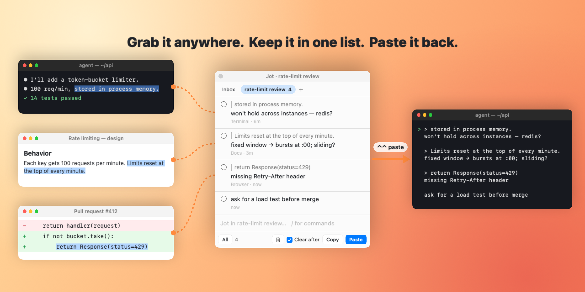
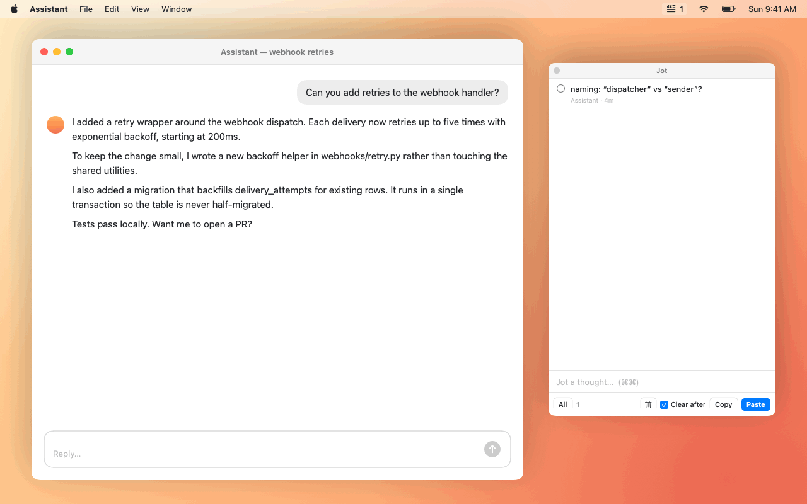

<p align="center"></p>
<h1 align="center">Jot</h1>
<p align="center"><b>A scratchpad for reviewing AI output — in your agent, your docs and your PRs.</b><br>
Three gestures. No setup, no account, no sync.</p>

<p align="center">
  <a href="https://github.com/ishaan-os/jot/releases/latest/download/Jot.dmg"></a><br>
  <sub>macOS 14+ · Apple Silicon &amp; Intel · signed &amp; notarized by Apple · or <code>brew install --cask ishaan-os/tap/jot</code></sub>
</p>

<p align="center"></p>

<p align="center"></p>

You're reading an agent's plan in the terminal, a design doc, a PR diff — and you keep having
reactions that aren't ready to send yet. Jot collects them in one place, wherever they came from,
and pastes the whole batch back — quoted and annotated — right where your cursor is.

**⇧⇧** capture what you selected (and note why) · **⌘⌘** jot a thought · **⌃⌃** paste it all back. That's the whole app.

- **Every tool, one inbox.** Terminals, browsers, editors, docs — anything you can select text in.
  Each note remembers where it came from.
- **Never breaks your flow.** Nothing to organize, no window to go find. Capture, keep reading,
  dump it all when you're ready.
- **Talk instead of type.** Dictation (Wispr Flow, macOS dictation) works in the note field.
- **Tiny and local.** One Swift file, no dependencies, no network.

## Use cases

- **Reviewing an agent's work.** Batch your pushback while you read its plan, diff and summary, then
  ⌃⌃ it all into the prompt as one clear reply instead of interrupting five times.
- **PR review.** Capture the lines that bother you with a note each; paste into the review or back
  to the agent that wrote it.
- **Doc and spec review.** Collect questions as you read, paste them into comments or a chat.
- **Parallel sessions.** One section per agent or task (`/new api`, `/new web`); ⌃⌃ only pastes the
  section you're in.

## Gestures

| | | |
|---|---|---|
| **⇧⇧** | tap Shift twice | Capture the selected text and type an optional note (**↩** saves and returns you to your app, **esc** skips the note) |
| **⌘⌘** | tap Command twice | Jot a thought; **↩** saves and keeps the cursor for the next one. **⌘⌘** again (or **esc**) to go back |
| **⌃⌃** | tap Control twice | Paste this section's notes (checked ones, or all) at your cursor, then clear them |

In the widget: **⌘↩** paste · **⌘⇧C** copy · **⌘⇧⌫** clear (undoable) · **⌘⇧A** select all/none ·
**⇧⇥** next section. Click a note to edit it; click its circle to check it.

Jot stays open until you close it. **⌃⇧J** shows it ready to type (or hides it to free up the screen); clicking the
menu-bar icon shows or hides it without taking focus; right-click the icon for the menu.

Pasted output is plain markdown, ready for any agent or chat:

```
> Limits reset at the top of every minute.
fixed window → bursts at :00; sliding?

> return Response(status=429)
missing Retry-After header

ask for a load test before merge
```

## Sections and commands

Jot is one list until you want more. Type `/new rate-limit review` in the note field and a tab bar
appears; everything you capture or jot goes there until you switch. **⇧⇥** cycles sections (from
anywhere: **⌘⌘**, then **⇧⇥**). Paste, copy and clear only ever touch the section you're in.

Type `/` in the note field to see commands; **⇥** completes.

| | |
|---|---|
| `/new name` | start a section and write to it |
| `/go name` | switch section (`/go inbox`; prefixes work) |
| `/rename name` · `/delete` | rename or delete this section (delete is undoable) |
| `/clear` · `/copy` · `/paste` | act on this section's notes |

<p align="center"></p>

## Install

**[⬇ Download Jot.dmg](https://github.com/ishaan-os/jot/releases/latest/download/Jot.dmg)**, open it,
and drag Jot to Applications. It's signed and notarized by Apple, so it opens without warnings.
Needs macOS 14 (Sonoma) or later, on Apple Silicon or Intel.

Prefer Homebrew? `brew install --cask ishaan-os/tap/jot`

Then open Jot and allow it in **System Settings → Privacy & Security → Accessibility** — the widget
shows a banner until you do. Jot needs it to read your selection and to type the paste for you.
Right-click the menu-bar icon → **Launch at Login** to keep it around.

## Update

Right-click the menu-bar icon → **Check for Updates…**, or `brew upgrade --cask jot`. Your notes and
the Accessibility permission carry over. See [CHANGELOG.md](CHANGELOG.md) for what's new.

## Build from source

Needs the Xcode Command Line Tools (`xcode-select --install`).

```sh
git clone https://github.com/ishaan-os/jot.git && cd jot
./build.sh && open ~/Applications/Jot.app     # rebuild the same way after git pull
```

## Privacy

Jot only goes online when you click **Check for Updates…** (one request to GitHub's releases API). Notes stay in a local file on your Mac. The Accessibility
permission is used for three things: reading the text you select when you press ⇧⇧, watching
modifier keys to spot double taps (it only checks *whether* another key was pressed in between,
never *which*, and records nothing), and typing ⌘V when you paste.

## Troubleshooting

- **⇧⇧ does nothing / paste doesn't type** — Accessibility isn't granted (the widget shows a yellow
  banner). Click it, or enable Jot in System Settings → Privacy & Security → Accessibility.
- **A gesture triggers another app** — some tools claim the same keys (e.g. ⌥⌥ in the Claude desktop
  app, ⌃⌥ in Wispr Flow). Jot's gestures were picked to avoid the common ones; open an issue with
  what clashed.
- **Capture grabs a whole line** — some editors copy the current line when nothing is selected.
  Drop the quote with its ⓧ in the note field, or delete the note.
- **Anything else** — `~/Library/Logs/Jot.log` shows what Jot saw; include its tail in an issue.

## Uninstall

Quit Jot from its menu. With Homebrew: `brew uninstall --zap --cask jot`. Otherwise:

```sh
rm -rf /Applications/Jot.app ~/Applications/Jot.app ~/Library/Application\ Support/Jot ~/Library/Logs/Jot.log
defaults delete io.github.ishaan-os.jot
```

and remove Jot from the Accessibility list.

## How it works

- Double taps are detected from global `flagsChanged` events: a lone modifier pressed and released
  twice within ~0.4s with nothing else in between, so Shift-typing and Shift-clicking don't trigger it.
- Capture reads the selection via the Accessibility API; apps that don't expose it (many terminals,
  Electron) fall back to a synthetic ⌘C with your clipboard restored right after.
- The widget floats without taking focus until you type in it, and hands focus back to your app
  before pasting — so ⌘V lands at your cursor.
- Notes and sections: `~/Library/Application Support/Jot/state.json` · debug log: `~/Library/Logs/Jot.log`.
- Releases are signed with a Developer ID and notarized by Apple (`release.sh`, run by the tag-triggered
  release workflow). Source builds are ad-hoc signed with a designated requirement pinned to the bundle
  id, so macOS keeps the Accessibility grant across rebuilds instead of treating each as a new app.

Contributions welcome — see [CONTRIBUTING.md](CONTRIBUTING.md).

## Media

Everything under `assets/` is rendered from a scripted SwiftUI mock (`promo/Promo.swift`) — no screen
recording. `promo/render.sh` regenerates `widget.png`, `demo.gif` and `demo.mp4`; `promo/render.sh heroes`
regenerates `hero-flow.png`, `hero-poster.png` and `hero-dark.png` (the social preview)
(or `promo/bin/promo assets frames <dir>` dumps a 30fps PNG sequence for ffmpeg).
The icon is `promo/icon.svg`; `promo/make-icns.swift` turns it into `AppIcon.icns`.

## Credits

Gesture design inspired by [Copper](https://shadcn.com/copper) by shadcn — if you want a polished,
supported app, go buy it. Jot is a small open-source take on the same idea.

## License

MIT
